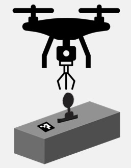

# ZephyrDock (Aerial Attach-Detach and Precision Deployment System)



This project builds upon the excellent work by ARK Electronics' "ROS2 & PX4 Precision Landing with ArUco Markers" implementation. We've extended their foundation with custom modifications including a state manager and specialized versions of the aruco tracker and precision landing packages for our specific use case.

Key Modifications:
* Added custom state management system (zd_px4_comm)
* Modified aruco_tracker package for dynamic marker id switching
* Modified precision_land package for hovering and customize search pattern, pid tuned result, and algorithm change for state switching justification
* Adapted the system for actual hardware interface (LiDAR TF-Mini, servo SM-80BL ModbusRTU, ultrasonic sensor GYUS42V2, etc.)
* Added flight review python files 
  python ./flight_pid_review.py        // for pid logging in /logs,  created automatically for each precision landing mode change
  python ./history_data_analysis.py    // for zd_logging in /logs,  created manually via running zd_logging node prior to flight (ros2 run zd_px4_comm zd_logging)

## Original Project Credit
The core functionality and initial setup process is based on ARK Electronics' open-source project:
ARK Electronics Tracktor Beam


## Manual
First of all,
Play with simulation before trying it on actual drone, link below leads to simulation git: 
  https://github.com/jyb612/simZephyrDock

while the similar setup procedure apply for actual drone testing, the onboard computer should use the current git
```
git clone https://github.com/jyb612/zephyrDock.git
```

To begin testing, run launch program via
```
ros2 launch zd_px4_comm MAIN_zd_launch.py 
```
then verify is LiDAR reading, camera topics, and the corresponding image_proc topics (bnw & color) behave normal.
then check if custom mode for precison landing successfully be created (from QGroundControl check if there's an extra mode or at launch terminal has written registered id...)

Before running the program, 
* make sure drone GPS 3D fix ready, 
* drone has sufficient battery power, 
* make sure remote is functioning (can try swapping mode or arm to see drone & QGroudnControl responses)
* testing environment setup done (ArUco marker placements)
  ArUco marker id 0 as drone home
  ArUco marker id 1 as robot home
  ArUco marker id 3 as robot (robot should be placed on ArUco id 1, but for testing without gripping, do not overlap them)
  ArUco marker id 3 should be placed at solar panel waypoint if Return mode is to be tested
* be ready to abort program via ctrl + c and swap to land mode (via remote) for emergency
* record flight and screen

If everything is fine, run logging via
```
ros2 run zd_px4_comm zd_logging
```

Run program (state manager) via
```
ros2 run zd_px4_comm zd_px4_command 
```

Follow the prompt to choose either of the modes (Deploy / Return)

When testing ended, ctrl + c to stop logging

For flight review, run in terminal
```
python historical_data_analysis.py
```

File select /logs/zd_sim_logging_... the latest csv file

and

```
python flight_pid_review.py 
```

File select /logs/pid_log_... the latest csv file


## Questions
Message Chua Jun Yan on LinkedIn for questions or email me at chua.junyan0612@gmail.com


# ROS2 & PX4 Precision Landing with ArUco Markers
Master the integration of ROS2, PX4, and OpenCV to achieve precision landing using ArUco marker detection. This tutorial delves into how to leverage ROS2's robust communication framework and PX4's flight control system to implement highly accurate landings for autonomous drones. You'll learn how to configure your environment, process camera feeds, and detect ArUco markers in real-time, enabling your drone to land precisely at designated targets. Whether you're new to drone development or an experienced engineer, this guide provides a step-by-step approach to achieving reliable precision landing with seamless integration into your ROS2 and PX4 projects.
#### ArUco Markers
Aruco markers are square fiducial markers used in computer vision for tasks like pose estimation, camera calibration, and augmented reality (AR). Each marker has a unique binary pattern inside a black border, allowing it to be easily detected and identified. They help in determining the position and orientation of cameras or objects in a scene, making them valuable in robotics, navigation, and AR applications.
https://docs.opencv.org/4.x/d5/dae/tutorial_aruco_detection.html


### Video Walkthrough
[Watch the video on YouTube](https://youtu.be/3BJB3OAo3tw?si=rJiTScTOzJzZjN2t)


### Prerequisites
* Ubuntu 22.04
* ROS2 Humble
* PX4 Autopilot with an ArUco Marker and downward facing camera
* Micro XRCE-DDS Agent
* QGroundControl Daily Build
* OpenCV 4.10.0
* ROS_GZ bridge

You can find the required instructions collected below

https://docs.px4.io/main/en/ros2/user_guide.html
https://docs.qgroundcontrol.com/master/en/qgc-user-guide/releases/daily_builds.html

You need the lates PX4-Autopilot, that will contain the required drone with the downward facing camera and the world that has the aruco marker in it
To get ros_gz bridge
```
sudo apt install ros-humble-ros-gzgarden
```
https://github.com/gazebosim/ros_gz


For the OpenCV part follow the instructions below

## Usage

### Setup the Workspace
Make sure you source ROS2 Humble in the terminal you are using.
```
source /opt/ros/humble/setup.bash
```
OR
Just add the line above to your bashrc, in that case it is going to be sourced every time you open a terminal.
```
nano ~/.bashrc
```

Navigate to the directory you would like to place the worskpace and then run the following
```
git clone https://github.com/jyb612/zephyrDock.git
```
Then navigate into the workspace:
```
cd tracktor-beam
```
Install OpenCV from source
```
./install_opencv.sh 
```
Install the submoduls
```
git submodule update --init --recursive
```
Build the workspace
```
colcon build
```
After this runs, we do not need to build the whole workspace again, you can just build the individual packages you have modified

```
colcon build --packages-select precision_land
```
Source the workspace
```
source install/setup.bash 
```
### Run the example
!!! YOU CAN NOW REFER TO THE GUIDE FOR ZEPHYRDOCK ABOVE
!!! BELOW IS FOR VERIFYING BASIC FUNCTION
!!! TO RUN THE LATEST RESULT SCROLL TO TOP CONTINUE WITH THE MANUAL


!!! BELOW IS FOR SIMULATION
#### Run the simulation environment
Launch PX4 sim
```
make px4_sitl gz_x500_mono_cam_down_aruco
```
Launch micro dds
```
MicroXRCEAgent udp4 -p 8888
```

Launch the ros_gz_bridge for getting the camera topic
```
ros2 run ros_gz_bridge parameter_bridge /camera@sensor_msgs/msg/Image@gz.msgs.Image
```

Launch the ros_gz_bridge for getting the camera info topic (this is how we get camera intrinsics)
```
ros2 run ros_gz_bridge parameter_bridge /camera_info@sensor_msgs/msg/CameraInfo@gz.msgs.CameraInfo
```

Launch the ros2 nodes (aruco_tracker)
```
cd tracktor-beam/
source install/setup.bash 
ros2 run aruco_tracker aruco_tracker 
```
OR
Launch file with the bridges:
```
source install/setup.bash
ros2 launch aruco_tracker aruco_tracker.launch.py 
```

View the video (/image_proc is the annoted image)
```
ros2 run rqt_image_view rqt_image_view
```

Launch the ros2 nodes (precision_land)
```
cd tracktor-beam/
source install/setup.bash 
ros2 run precision_land precision_land
```
OR
Launch file with the params:
```
ros2 launch precision_land precision_land.launch.py
```
Once the nodes are running the Precision Land mode is going to show up in QGC


## ARK Electronics
For more open-source drone-related material, follow us on LinkedIn and Twitter:

[LinkedIn](https://www.linkedin.com/company/ark-electronics-llc/)

[X](https://x.com/ark_electr0nics)

If you're interested in US-manufactured drone hardware, please visit our webpage:

[ARK Electronics](https://arkelectron.com/)

## Questions
Message Patrik Dominik Pordi on the ARK Electronics / Dronecode Foundation Discord for questions or email me at patrik@arkelectron.com

[ARK Electronics Discord](https://discord.gg/un4HYu8k)


## Additional resources
[LinuxCheatSheet](https://www.geeksforgeeks.org/linux-commands-cheat-sheet/)

[ROS2CheatSheet](https://www.theconstruct.ai/wp-content/uploads/2021/10/ROS2-Command-Cheat-Sheets-updated.pdf)

[CMakeBasics](https://nu-msr.github.io/navigation_site/lectures/cmake_basics.html)

### Hardware
#### Prerequisites
* Ubuntu 22.04
* ROS2 Humble
* Drone with downward facing camera
* Micro XRCE-DDS Agent
* QGroundControl
* OpenCV 4.10.0
* Camera node:
I use an usb camera, there is a ROS2 package already out there for it:
https://github.com/ros-drivers/usb_cam.git

You can either run the the nodes or turn them into a service, that starts at boot:
#### Normal run

##### Service

First, you need to move your service file to the /etc/systemd/system/ directory, where systemd can find it. Replace myservice.service with the actual name of your service file.

Ensure that the service file has the correct permissions. Typically, it should be readable by all users:
```
sudo chmod 644 /etc/systemd/system/myservice.service

```
After copying the service file, reload the systemd daemon to recognize the new service:

```
sudo systemctl daemon-reload

```
Start the service using systemctl:

```
sudo systemctl start myservice

```
If you want the service to start automatically on boot, enable it:

```
sudo systemctl enable myservice

```
Verify that the service is running correctly:
```
sudo systemctl status myservice

```
